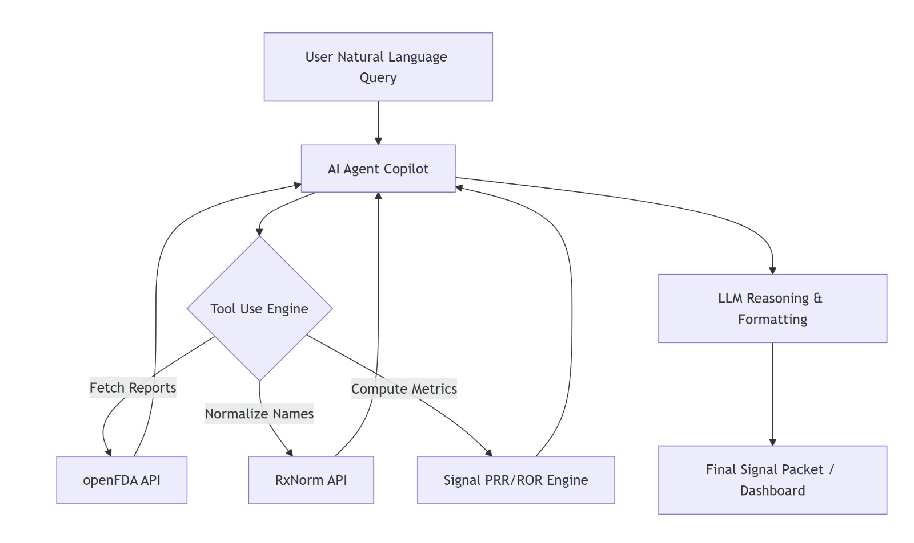

# 🩺 Pharmacovigilance Signal Triage Copilot
**Agent Inteligent pentru Prioritizarea Semnalelor de Siguranță în Medicamente**

---

## 🎯 Definirea Problemei

Echipele de siguranță medicamentoasă (Pharmacovigilance / PV) primesc anual **milioane de rapoarte** privind efectele adverse ale medicamentelor. Datele sunt frecvent incomplete, redundante și neuniforme (ex: denumiri comerciale diferite pentru aceeași substanță activă). Procesul manual de triaj este lent și predispus la erori, întârziind detectarea semnalelor critice.

- **Inputs:** Rapoarte brute de reacții adverse (format JSON/CSV) extrase din baza de date publică openFDA FAERS + cerința utilizatorului în limbaj natural (ex: *„Analizează semnalele pentru DUPIXENT în 2024"*)
- **Outputs:** Un **Signal Packet PDF** generat automat conținând: lista prioritizată a semnalelor, metrici statistice (PRR, ROR), grafice de trend lunar și recomandări AI explicabile

---

## 🏗️ Schema Arhitecturală



**Fluxul autonom al agentului (7 pași):**

```
PAS 1: filtreaza_dupa_timp        → selectează rapoartele din intervalul cerut
PAS 2: normalizeaza_medicament    → brand → INN via RxNorm API (NIH)
PAS 3: normalizeaza_reactie       → termen liber → MedDRA Preferred Term
PAS 4: calculeaza_metrici         → PRR, ROR, trend lunar, scor prioritizare
PAS 5: extrage_cazuri             → drill-down: 5 rapoarte individuale
PAS 6: formuleaza_recomandari     → LLM generează justificare text
PAS 7: genereaza_pachet_pdf       → PDF exportabil cu grafice embedded
```

---

## 🧠 Tipul de AI Folosit

| Componentă | Tehnologie | Justificare |
|---|---|---|
| **LLM** | Llama 3.3 70B (Meta, open-source) | Gratuit, 70B parametri, urmează instrucțiuni de tool-use corect |
| **Provider inferență** | Groq API (LPU hardware) | 14.400 req/zi gratuit, latență < 1s/token |
| **Agent framework** | LangGraph `create_react_agent` | Pattern ReAct: ciclează Reason→Act autonom până finalizează toți pașii |
| **Tool use** | 6 funcții `@tool` LangChain Core | Docstring-ul fiecărei funcții = descrierea pentru agent |
| **Normalizare medicamente** | RxNorm API (NIH/NLM) | Standard de facto SUA, gratuit, tolerant la variante ortografice |
| **Normalizare reacții** | Mapping local MedDRA PT (~30 termeni) | MedDRA complet necesită licență; mapping local acoperă termenii FAERS frecvenți |
| **UI** | Gradio `share=True` | Link public temporar, fără deployment, ideal pentru demo |
| **Export** | fpdf2 | PDF cu format fix, non-editabil — standard în medii reglementate FDA/EMA |

---

## 📈 Performanță Obținută (KPI măsurați live)

| KPI | Manual (referință) | Cu AI (măsurat) |
|---|---|---|
| ⏱️ Timp per semnal | ~45 minute | ~45 secunde |
| 📦 Pachete/analist/zi (8h) | ~10 | ~100+ |
| 🕐 Timp semnal → revizuire | ore / zile | secunde |
| 📋 Standardizare output | variabilă | ✅ 5 secțiuni identice la fiecare rulare |
| 🔁 Reproductibilitate | manuală | ✅ automată (seed date + deduplicare) |

> Benchmark manual de 45 min/pachet conform literaturii de specialitate PV (Evans et al., 2001).

---

## 🌍 Obiective de Dezvoltare Durabilă (SDGs) Impactate

**SDG 3 — Sănătate și Bunăstare**
Detectarea timpurie a combinațiilor periculoase medicament–eveniment reduce riscul de vătămare al pacienților. Fiecare săptămână câștigată în identificarea unui semnal poate preveni reacții adverse grave la mii de pacienți.

**SDG 9 — Industrie, Inovație și Infrastructură**
Modernizarea proceselor din industria farmaceutică prin automatizare AI — elimină munca repetitivă și permite specialiștilor să se concentreze pe decizii de înaltă valoare.

**SDG 10 — Inegalități Reduse**
Echipele PV mici (țări în curs de dezvoltare, producători generici) nu-și pot permite analiști seniori specializați. Agentul democratizează accesul la analiză de calitate regulatorie.

---

## 📁 Structura Proiect

```
├── notebooks/
│   ├── 01_EDA.ipynb                       # Ingestie date FAERS + EDA + vizualizări
│   └── 02_Agent_AI_v2.ipynb               # Agent AI + 6 tools + UI Gradio + Teste
├── data/
│   ├── faers_raw_sample.json              # Date brute FAERS 2022–2024 (openFDA)
│   ├── cleaned_faers_data.csv             # Date procesate după EDA
│   └── cleaned_faers_data_deduped.csv     # Date după deduplicare automată
├── .env.example                           # Template chei API
├── .gitignore                             # Exclude .env și date sensibile
└── README.md
```

---

## ⚙️ Configurare Rapidă

**1. Clonați repo-ul**
```bash
git clone https://classroom.github.com/a/LESHiTyK
cd <nume-repo>
```

**2. Creați fișierul `.env`**
```bash
cp .env.example .env
# Deschideți .env și completați cheile:
```
```
GROQ_API_KEY=cheia_voastra_de_la_console.groq.com
FDA_API_KEY=cheia_voastra_de_la_open.fda.gov   # opțional
```

**3. Rulați notebook-urile în ordine**
```
01_EDA.ipynb           →  generează data/cleaned_faers_data.csv
02_Agent_AI_v2.ipynb   →  pornește agentul + UI Gradio (link public în output)
```

**Obținere chei API (gratuit):**
- `GROQ_API_KEY` → [console.groq.com](https://console.groq.com) — înregistrare simplă, 14.400 req/zi
- `FDA_API_KEY` → [open.fda.gov/apis](https://open.fda.gov/apis/) — opțional, mărește rate limit-ul

---

## 📚 Bibliografie & Surse Date

| Resursă | URL |
|---|---|
| openFDA FAERS API | https://open.fda.gov/apis/drug/event/ |
| RxNorm API (NIH) | https://lhncbc.nlm.nih.gov/RxNorm/ |
| Evans et al. 2001 (criteriu PRR) | *Use of proportional reporting ratios (PRRs) for signal generation from spontaneous adverse drug reaction reports* |
| LangGraph ReAct | https://langchain-ai.github.io/langgraph/ |
| Groq API | https://console.groq.com |
